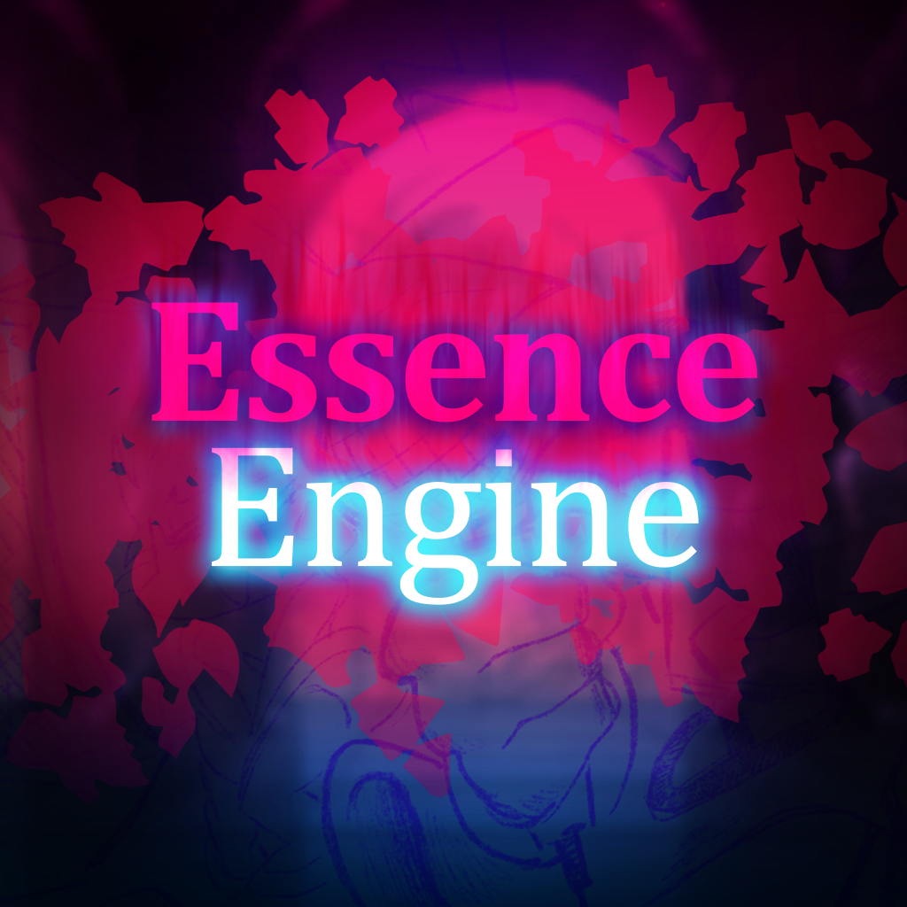
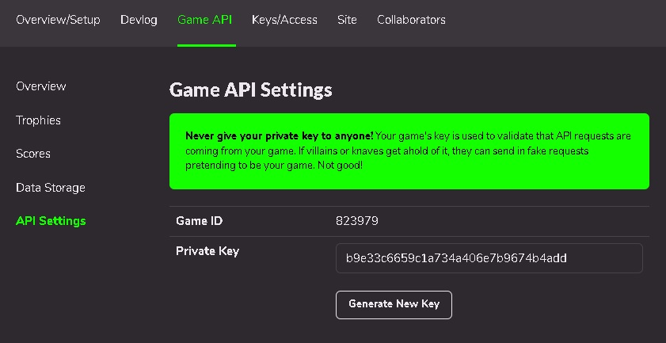

# Friday Night Funkin' - Essence Engine

A very-very modified [Psych Engine](https://github.com/ShadowMario/FNF-PsychEngine) (<- Some cool stuff are there)!

This engine used for mod - "[FNF: Entity Mrzk Version V2](https://gamebanana.com/mods/496620)"!
In the future, it is planned (FOR GAMEJOLT REPOST) to support GameJolt for mods that work in the source code! As well as more improved editors (chart, week, dialogue and other... stage?), more options and extended freeplay/options menu's!

## Installation:

Refer to [the Build Instructions](bin/setup/README.md)

## Customization:
[Gamejolt](https://gamejolt.com/) support!

change `GJApi.hx` in `src/funkin/api/GJApi.hx` to your game id and private key

## Credits:
* Marazak(X)/Mrzk(X) - Programmer / Almost Artist

this .md will be extended later...
