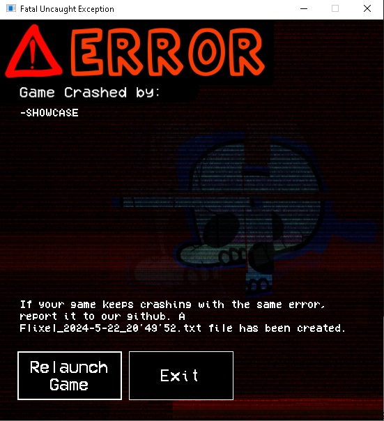

# Crash Handler for flixel/haxeflixel
FlixelCrashHandler is an c# application made in Visual Studio with the [Windows Forms .NET Framework](https://learn.microsoft.com/en-us/dotnet/desktop/winforms/overview/?view=netdesktop-6.0).

## License and usage
This project is licensed under the [MIT license](LICENSE), you are allowed to copy, modify, merge, publish, distribute, sublicense and freely use this resource in your projects, **no credits are required**, but it would be nice to do so :)

## Edditing
If you want to edit the FlixelCrashHandler, download the visual studio solution and modify however you want, but keep in mind, **DO NOT COMPILE IT IN RELEASE MODE, COMPILE IT IN DEBUG MODE** AS IN RELEASE MODE IT WILL THROW AN ERROR FOR SOME REASON!
